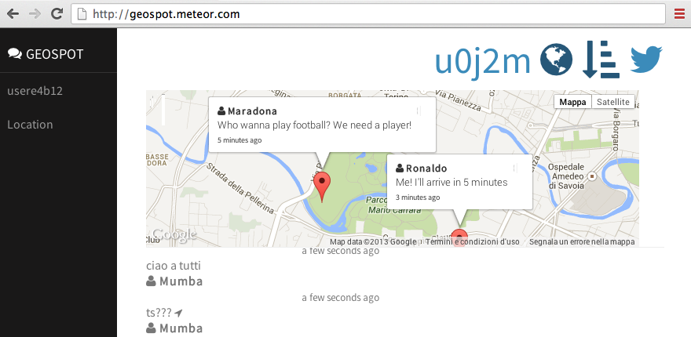

##Geospot

### A Geolocalized Proximity Chat with optional precise position.

Geospot will allow you to chat with people nearby and the message will expire in 72h

Live at: http://geospot.meteor.com

# Installation

Install `meteor` and `meteorite` and run the `meteor` command.

# License

MIT. See the `client/vendor` for the other libraries included.

# Contact
Luigi Maselli, [grigio.org](http://grigio.org), twitter: [@grigi0](http://twitter.com/grigi0)
